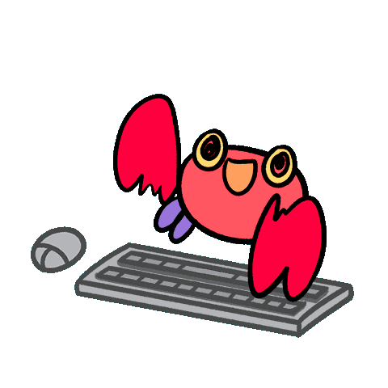
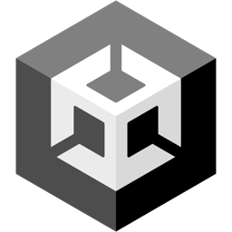

<table border="2">
<tr>
    <td>
		

			<h2> ✌️ Shalom ✌️ <h2>
			
		

	</td>
    <td width = "65%">
		

			
			
		

	</td>
</tr>
</table>
<table border="1">
	<tr>
		<td width ="60%" >
			<h3 align="center">What am I 👻</h3>
			<ul>
				<li> 🔥 I am a programmer-enthusiast from St. Petersburg.
				<li> 🚀 I'm on my way to being a Flutter developer right now.
				<li> 😃 In my free time I do mobile game development and practice cardistry.
				<li> 🎪 I am a 2nd year student at SUAI.
			</ul>
		</td>
		<td align="center" width="1000px">
			<h3> Languages and tools 🛠️ <h3>
			<h4> ❤️ My favorite ❤️ </h4>
			
			
			
			 
			
			
			 
			&nbsp;
			&nbsp;
			<h4>Has worked</h4>
			&nbsp;
			&nbsp;
			&nbsp;
			&nbsp;
			&nbsp;
			&nbsp;
		</td>
	</tr>
</table>
