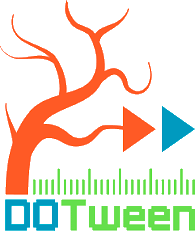

	
	

		
		
		<!--
		
		-->
		
	

	<h1>✌️ Shalom ✌️</h1>

## What am I :suspect:
I am a programmer-enthusiast from St. Petersburg. 🔥
- 🚀 I'm on my way to being a Flutter developer right now. 🚀 
- 😃 In my free time I do mobile game development and practice cardistry.
- 🎪 I am a 2nd year student at GUAP.

---

## Languages and tools 🛠️
### My favorite ❤️: 
&nbsp;
&nbsp;

&nbsp;
&nbsp;

&nbsp;
&nbsp;
 

 

### Have an unforgettable experience 😎:
&nbsp;

&nbsp;
&nbsp;
&nbsp;
&nbsp;

---

## My progress 🎃

